## Jobsheet Week 3
Muhammad Zuhdi Yudadharma  
244107020017  
TI - 2F

## Komfigurasi ENV

## Migration

1. Praktikum 2.1  

2. Praktikum 2.2

-----------------------------------------------

## Sedders

1. Praktikum 3
- level

- user

- kategori

- supplier

- barang

- stok

- penjualan

- detail penjualan

------------------------------------------------

## DB Facecade

1. Praktikum 4
- insert level  
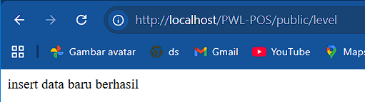  
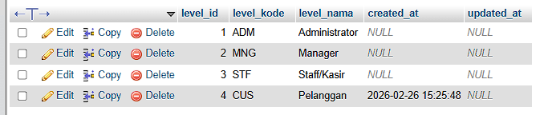
- level update
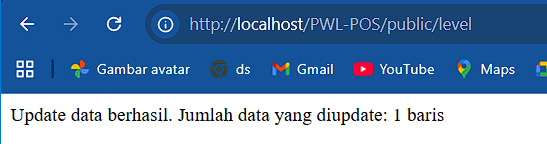  
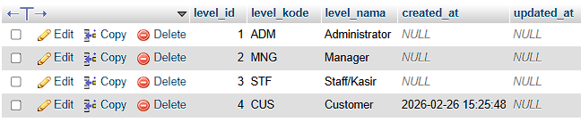
- level delete
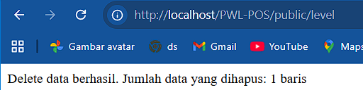  
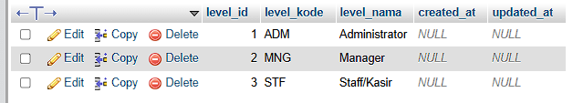
- view delete
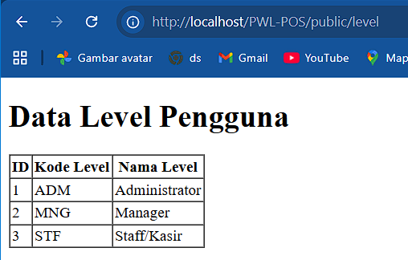

------------------------------------------------

## Query Builder
1. Praktikum 5
- insert kategori  
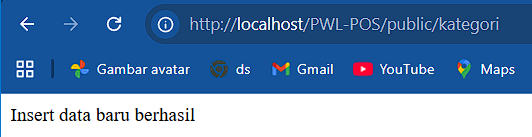  
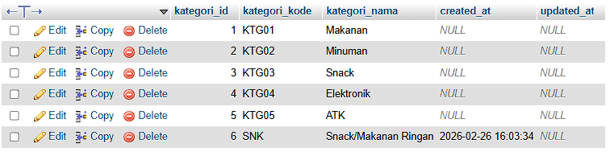
- level update
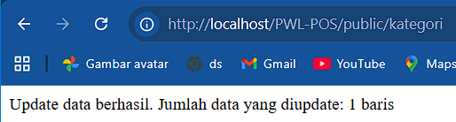  
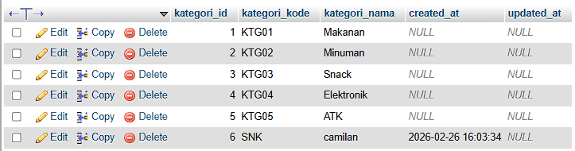
- level delete
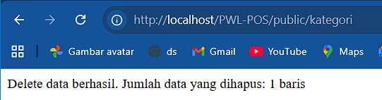  
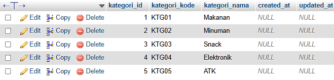
- view delete
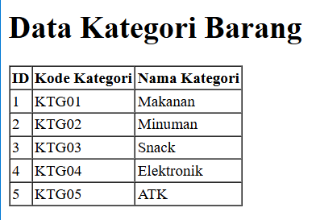

------------------------------------------------

## Eloquent ORM
1. Praktikum 6