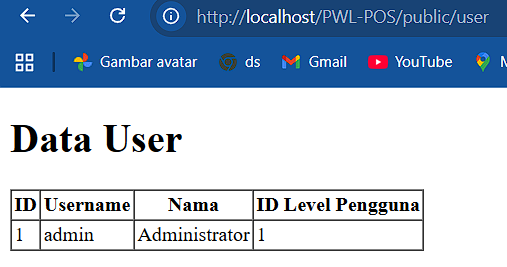
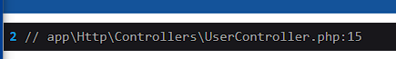
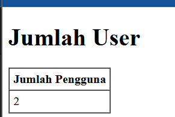

## Jobsheet Week 4
Muhammad Zuhdi Yudadharma  
244107020017  
TI - 2F

## $fillable:
1. Praktikum 1  

- create user 1  

- create user 2 (terjadi eror karena $password dihapus di fillable) 

## Retrieving Single Models
1. Praktikum 2.1  

- find id 1  

- find id where  

- find id firstWhere  

- find id findOr  

- find id findOr eror  

## Not Found Exceptions
1. Praktikum 2.2  

- findOrFail 1  

- firstOrFail 2 eror 

## Retreiving Aggregrates
1. Praktikum 2.3  

- count  

- view  

## Retreiving Or Creating Models
1. Praktikum 2.4  

- firstOfCreate  

- firstOfCreate (create)  

- fistOfNew  

- fistOfNew (create)  

- fistOfNew (save)  

## Attribute Changes
1. Praktikum 2.5  

- isDirty  

- wasChanged  

## Create, Read, Update, Delete (CRUD)
1. Praktikum 2.6  

- view CRUD  

- View create  

- create  

- view edit (edit)  

- edit (hasil)  

- delete ID 17  

## Relationships
1. Praktikum 2.7  

- belongsTo (view DD, saya tambahkan LevelModel.php karena tidak ada relasi LevelModel di jobsheet)  

- View   
